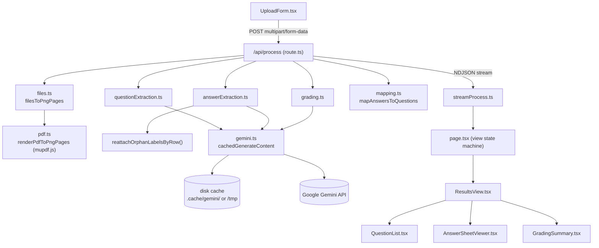
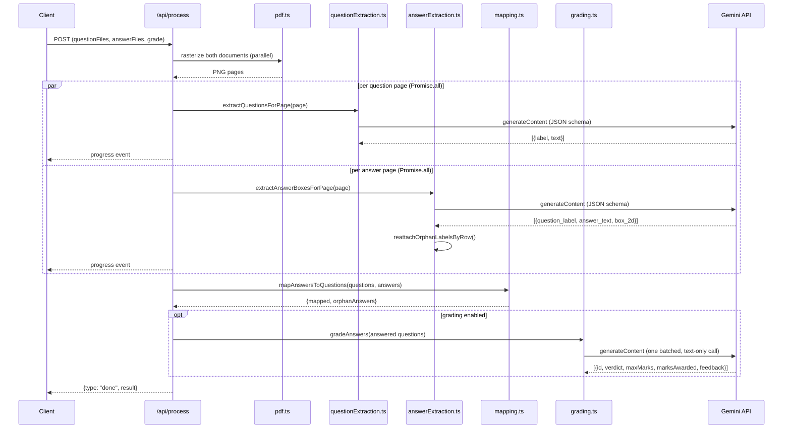

# Low-Level Design

This is the implementation-level companion to the [README](./README.md), which covers the *why*. This covers the *how*: module boundaries, data flow, and the two algorithms that carry the actual logic — label matching and the row-based orphan-reattachment heuristic.

## 1. Component diagram



`mapping.ts` has no arrow into `gemini.ts` or any Gemini module — that's deliberate. It's a pure function (`(Question[], AnswerRegion[]) → MappingResult`), which is what makes it unit-testable with plain objects and zero network calls (see `§4`).

## 2. Request lifecycle



Page extraction runs concurrently within each document (`Promise.all`, not a sequential loop) — this exists specifically because sequential per-page calls on a real multi-page document exceeded Vercel's serverless time limit and hung the client with no error. See `§5`.

## 3. Module responsibilities

| Module | Responsibility |
|---|---|
| `src/lib/types.ts` | The shared data model — every cross-module contract lives here (`Question`, `AnswerRegion`, `MappedQuestion`, `MappingResult`, `GradingResult`, `ProcessResult`, `ProcessEvent`). |
| `src/lib/pdf.ts` | Rasterizes a PDF buffer into one PNG buffer per page via mupdf.js (WASM, no native dependency — required for Vercel's serverless runtime). |
| `src/lib/files.ts` | Normalizes a mixed upload (one PDF, or several images) into an ordered list of page images, regardless of which the teacher chose. |
| `src/lib/gemini.ts` | The only module that talks to the Gemini API. Owns: disk-backed response caching (keyed on model+prompt+schema+image hash), the primary→fallback model retry on quota exhaustion, and `temperature: 0` for grounding consistency. |
| `src/lib/questionExtraction.ts` | Prompt + schema for turning one question-paper page into `{label, text}[]`, preserving printed order and splitting labelled sub-parts. |
| `src/lib/answerExtraction.ts` | Prompt + schema for turning one answer-sheet page into `{question_label, answer_text, box_2d}[]`, plus `reattachOrphanLabelsByRow` (§4.2). |
| `src/lib/mapping.ts` | Pure function: matches answers to questions by normalized label. No I/O, no Gemini — this is what's most directly unit-tested. |
| `src/lib/grading.ts` | One batched, text-only Gemini call that scores every answered question at once. |
| `src/app/api/process/route.ts` | Orchestrates the above into a streamed NDJSON response; the only place that knows the full pipeline order. |
| `src/lib/streamProcess.ts` | Client-side NDJSON reader with a stall watchdog (§5). |
| `src/components/*` | Presentational only — no module here calls Gemini or touches `fetch` directly except `streamProcess.ts`. |

## 4. The two algorithms that matter

### 4.1 Label-based matching (`mapping.ts`)

```
normalizeLabel(raw) = lowercase(raw)
                        .strip leading "answer"|"ans"|"solution"|"sol"|"question"|"q" (+ optional . : and whitespace)
                        .strip everything that isn't [a-z0-9]
```

`"11 (a)"`, `"11a)"`, `"Q11a"`, and `"Ans. 11(a)"` all collapse to `"11a"`. Matching is then a single hash-map lookup: `Map<normalizedLabel, AnswerRegion[]>` built from every answer, looked up once per question.

Every edge case the brief names falls out of this being **label-keyed, not position-keyed** — none of them are special-cased branches:

| Case | Mechanism |
|---|---|
| Answers out of order | Map lookup doesn't care about insertion order |
| Unanswered question | Zero entries at that key → `status: "unanswered"` |
| Answer matches no question | Never touched during the question-side pass → collected as `orphanAnswers` |
| Answer spans multiple pages | Same key, entries with >1 distinct `pageIndex` → `status: "answered_multi_page"` |

### 4.2 Row-based orphan reattachment (`answerExtraction.ts`)

A real failure mode found live: a student answers one question as a side-by-side block (e.g. a two-column comparison table) with the question number written only once. Extraction correctly finds both halves as separate regions, but only one carries a label — the other would otherwise become a silent orphan, and the highlight would only cover half the real answer.

```
for each unlabeled region B on a page:
    for each labeled region C on the same page:
        rowOverlap = verticalOverlap(B, C) / min(height(B), height(C))
        gap        = B.xMin - C.xMax   // distance from C's right edge to B's left edge

        if rowOverlap > 0.5 and gap >= -20:
            B is a candidate continuation of C

    B inherits the label of whichever candidate has the smallest gap (closest to its left)
```

Deliberately conservative on both axes:
- **>50% row overlap** — two answers that merely happen to be near the same height don't qualify; they have to substantially share a row.
- **Adjacent, not just row-aligned** — requires the labeled region to sit immediately to the *left*, matching how a continuation is actually written. This is what keeps it from misfiring on something like two independent MCQ columns at the same row height: those already carry their own labels, so they're never in the "unlabeled" candidate pool to begin with.

This runs as a deterministic post-process, not a second model call — it doesn't cost any extra Gemini quota, and it's the same result on every run for the same input (verifiable without hitting the network).

## 5. Reliability

- **Disk-backed cache** (`gemini.ts`) — every call is keyed on a hash of `(model, promptVersion, systemInstruction, prompt, schema, imageBytes)`. Local dev writes to `.cache/gemini/`; on Vercel (`process.env.VERCEL` set, read-only filesystem outside `/tmp`) it switches to `os.tmpdir()` automatically.
- **Quota fallback** — a 429/`RESOURCE_EXHAUSTED` from the primary model triggers one automatic retry against a secondary model, cached under its own key so it never collides with the primary model's cache entries. Not the default model: A/B testing on real data found real accuracy regressions in candidate fallback models (worse label attribution; one hallucinated content from a blank page's ink bleed-through), so it only engages when the alternative is an outright failed request.
- **Parallel page extraction** — pages within a document are extracted concurrently (`Promise.all`), not in a sequential loop. This exists because sequential extraction on a real multi-page document exceeded Vercel Hobby's serverless duration ceiling (~60s regardless of the `maxDuration` declared in code), which killed the function mid-stream and hung the client with no error surfaced.
- **Client-side stall watchdog** (`streamProcess.ts`) — every `reader.read()` races a 45s timeout. If the server ever goes silent again (this cause or a new one), the client gets a clear, actionable error instead of hanging indefinitely.
